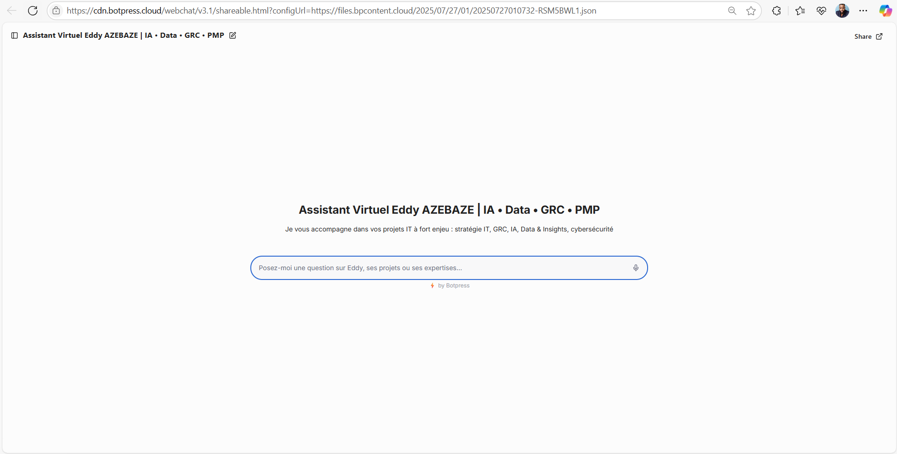

# 🤖 Assistant Virtuel Eddy AZEBAZE | IA • Data • GRC • PMP

  
[🔗 Démo en ligne](https://cdn.botpress.cloud/webchat/v3.1/shareable.html?configUrl=https://files.bpcontent.cloud/2025/07/27/01/20250727010732-RSM5BWL1.json)

Bienvenue dans ce projet démonstrateur **no-code**, conçu pour mettre en valeur ma **proposition de valeur augmentée** en tant que chef de projet transversal à l’ère de l’IA, de la GRC, de la data et de la conformité.

Ce projet intègre également une **démarche de veille technologique stratégique**, via une analyse comparative entre Botpress, Dialogflow et d'autres outils conversationnels (cf. [`resources-outils-chatbot.md`](./resources-outils-chatbot.md)).

---

## 🚀 Objectif

Créer un assistant conversationnel professionnel, directement accessible en ligne, qui synthétise :  
- ma vision projet,  
- mes offres & cas d’usage,  
- mes livrables différenciants,  
- sans backend, sans code, et sans coût caché.

---

## 🧠 Contexte / Pourquoi

À l’ère des **projets augmentés** et des **profils hybrides**, il est essentiel de **présenter clairement sa valeur ajoutée** de façon structurée, conversationnelle et démontrable.

Ce chatbot joue le rôle d’un **point d’entrée stratégique** dans mon univers professionnel :  
- GRC (Gouvernance, Risques, Conformité)  
- IA & projets innovants  
- Data & Insights métier  
- PMP® & gestion de portefeuille

Il permet à tout interlocuteur (recruteur, prospect, partenaire) de découvrir :  
✔️ mes projets GitHub  
✔️ ma méthode AZEBAZE  
✔️ mes offres et persona cibles  
✔️ des démonstrations réelles de mon approche

---

## 🔧 Technologies / Outils utilisés

- Botpress Cloud (no-code)
- Hébergement via CDN (lien partageable)
- Fichiers JSON exportés (flow)
- Intégration iframe
- Interface conversationnelle responsive

---

## 📋 Livrables

- ✅ Assistant conversationnel déployé
- 📄 Documentation complète (`README.md`, `demo.md`, `iframe.md`, etc.)
- 🖼️ Captures visuelles (iframe, use cases, arborescence)
- 🔍 Comparatif outils et stratégie de veille (`resources-outils-chatbot.md`)
- 🔜 Article Medium & page Notion à venir

---

## 🧩 Méthodologie AZEBAZE

1. **Diagnostic** – besoins, contexte, ciblage  
2. **Cadrage** – structure, ton, cas d’usage  
3. **Delivery** – prototypage Botpress, test & itérations  
4. **Résultats & Suivi** – déploiement, intégration GitHub, future V2 RAG

---

## 🖼️ Aperçu intégré (iframe)

Voici à quoi ressemble l’assistant en version embarquée sur un site :

---

## 💬 Exemple d'interaction (use case réel)

Interaction sur l’AI Act, les offres et la méthode AZEBAZE :

---

## 🧠 Vue backend / configuration Botpress

Illustration de l’arborescence du bot dans Botpress Cloud :

---

## 🎯 Résultats / Impact

- 🎯 **Positionnement clair** : IA + GRC + PMP
- 🔗 **Entrée stratégique** vers mes offres, contenus & personas
- ⚡ **MVP no-code livrable en 2 jours** avec impact immédiat

---

## 🔗 Ressources associées

- [🟢 Démo Botpress en ligne](https://cdn.botpress.cloud/webchat/v3.1/shareable.html?configUrl=https://files.bpcontent.cloud/2025/07/27/01/20250727010732-RSM5BWL1.json)
- [`demo.md`](./demo.md) – Retour d’expérience complet
- [`iframe.md`](./iframe.md) – Aperçu intégré (iframe)
- [`resources-outils-chatbot.md`](./resources-outils-chatbot.md) – Comparatif Botpress/Dialogflow + veille stratégique
- [`/exports/`](./exports/) – Export JSON du flow (à venir)
- [`/screenshots/`](./screenshots/) – Captures visuelles

---

## 🧠 Topics GitHub

`assistant-virtuel`, `botpress`, `portfolio`, `chatbot-no-code`, `GRC`, `MVP`,  
`eddyazebaze`, `pmp`, `data-insights`, `ia-generative`, `no-code`,  
`AI-projects`, `prompt-engineering`, `conformite-numerique`, `learning-project`

---

## 📬 Contact

**Eddy AZEBAZE**  
📧 eddy.azebaze@proton.me  
🔗 [LinkedIn](https://www.linkedin.com/in/eddy-azebaze-034a20226)

> “On ne livre pas un projet. On construit un actif stratégique : durable, traçable et auditable.”
