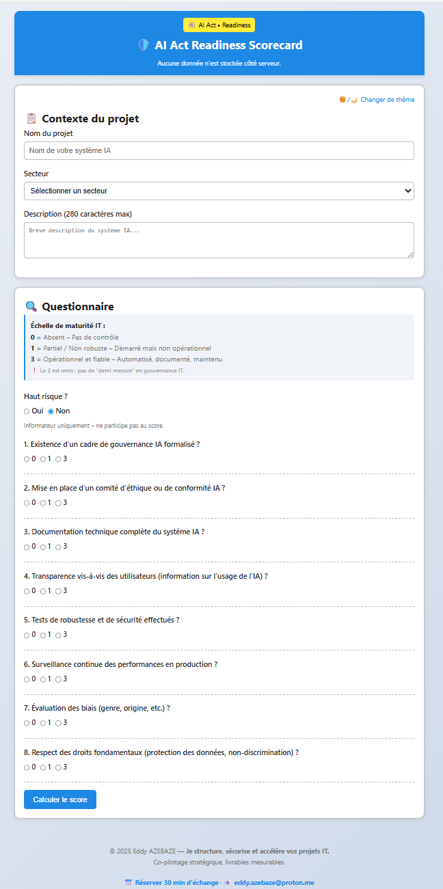
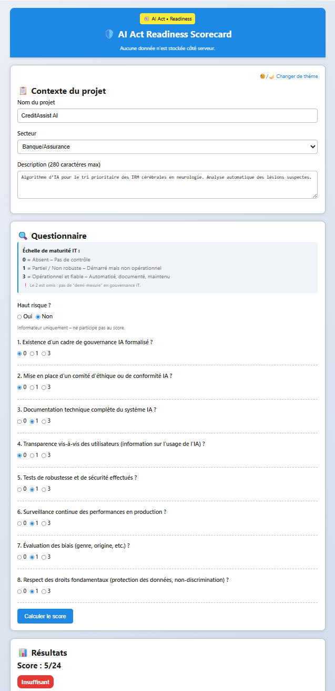
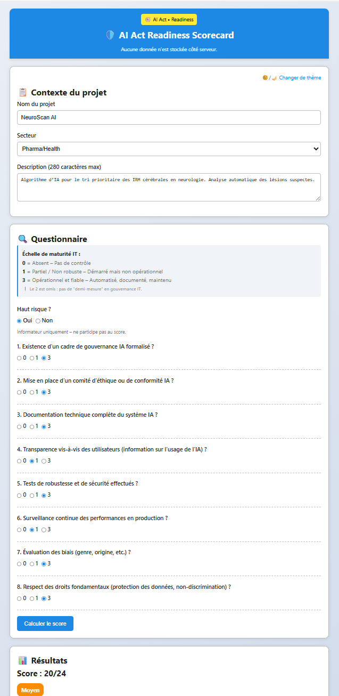
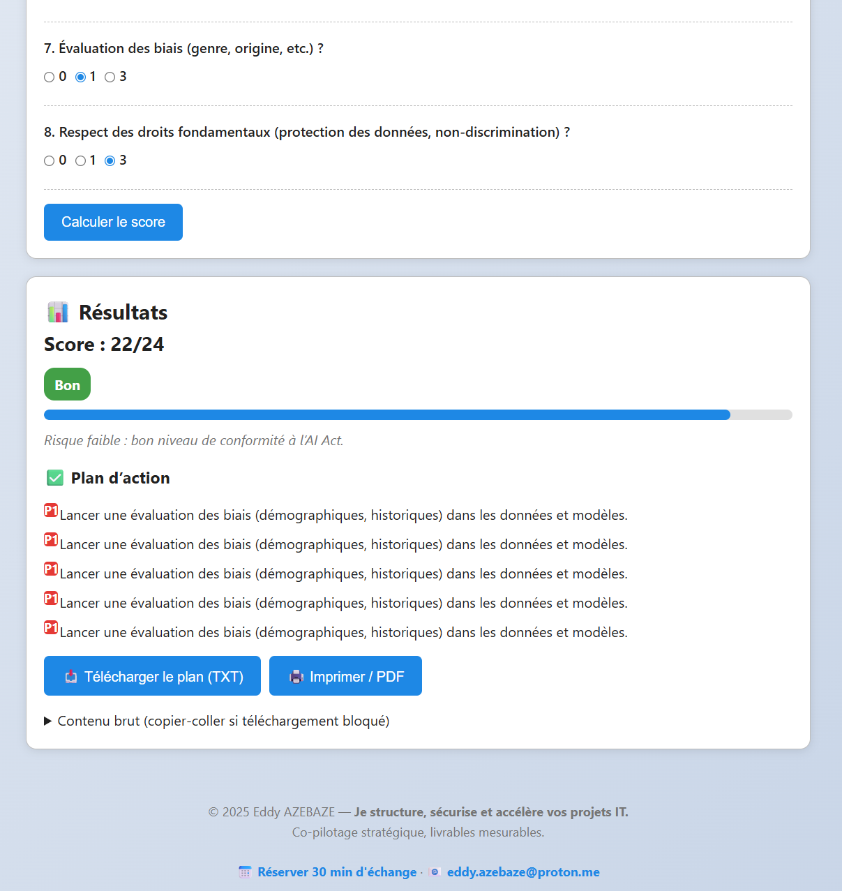

# 🛡️ AI Act Readiness Scorecard  
### _Outil d’auto-évaluation de conformité IA – Orienté DSI / CTO / Architectes_

> 🔐 **100 % hors ligne • Zero dépendance • Aucune donnée collectée • Conforme RGPD par conception**

[📱 Mobile & Web] • [✅ Hors ligne] • [🇫🇷 FR] • [🔒 Zero data]

➡️ **[👉 Accéder à la démo web](https://drive.google.com/file/d/1HpOpIDhgdS3ZMlbaKKTIynjAB1n4rhrZ/view?usp=drive_link)**

> *"Un contrôle incomplet n’est pas un contrôle."*  
> Cet outil évalue la **maturité IT réelle** d’un système IA face à l’AI Act — pas seulement la compliance théorique.

---

## 🎯 **À propos du projet**

L’**AI Act Readiness Scorecard** est un outil **autonome, rapide et pragmatique** que j’ai conçu pour aider les **décideurs IT** (DSI, CTO, DPO) à :

- 🔍 **Évaluer la conformité** de leurs systèmes IA à l’**AI Act européen**
- 🚨 **Détecter les écarts critiques** en gouvernance, sécurité, transparence
- 📌 **Prioriser les actions IT** (P1/P2/P3) selon le risque opérationnel
- 📄 **Générer des artefacts prêts pour l’audit** (PIA allégé, documentation, logs)
- 🌐 **Parler le langage du SI**, pas seulement celui du juridique

👉 **Public cible** : DSI, CTO, chefs de projet IA, DPO, auditeurs internes.

---

## 🧠 **Valeur ajoutée**

| Ce que fait l’outil | Pourquoi c’est différent |
|---------------------|--------------------------|
| ✅ Évaluation en 5 min | Pas besoin de juriste pour démarrer |
| ✅ Score sur 24 points | Maturité IT réelle, pas du théorique |
| ✅ Plan d’action P1/P2/P3 | Recommandations techniques priorisées |
| ✅ 100 % hors ligne | Aucun risque de fuite, pas de cloud, pas de RGPD à craindre |
| ✅ Export audit-ready | TXT, PDF, impression — prêt pour le comité |

> 💡 **Mon positionnement** : Je ne fais pas de la compliance juridique.  
> Je fais de la **conformité opérationnelle**, par et pour le **système d’information**.

---

## 📱 **Version mobile (iOS)**

Disponible via [Emergent.sh](https://emergent.sh), l’application mobile permet une évaluation **directement sur smartphone**, idéale pour les comités de pilotage, audits de terrain ou déplacements.

### 🔧 Stack technique
- **Framework** : React Native + Expo
- **Navigation** : Expo Router
- **Hors ligne** : 100 % autonome
- **Export** : TXT + partage natif iOS

### 📂 Structure

mobile/
├── exports/
│ └── emergent-export.zip → Projet complet (à réimporter dans Emergent.sh)
├── screenshots/
│ ├── home-screen.png
│ ├── score-credit-assist-ai.png
│ ├── score-neuroscan-ai.png
│ └── score-hr-assistant-pro.png
└── README.md → Documentation mobile

---

## 🧩 **Méthodologie de scoring**

### 🔢 Échelle de notation (maturité IT)
| Note | Signification |
|------|---------------|
| **0** | ❌ Absent – Pas de contrôle |
| **1** | ⚠️ Partiel / Non robuste |
| **3** | ✅ Opérationnel et fiable |

> ❗ Le **2 est omis** : pas de "demi-mesure" en gouvernance IT.

### 📊 Calcul du score
- 8 questions × 3 points max = **/24**
- Niveaux :
  - **0 - 10** : ❌ Insuffisant (risque élevé)
  - **11 - 20** : 🔶 Moyen (améliorations nécessaires)
  - **21 - 24** : ✅ Bon (conformité solide)

---

## ⚠️ **Question "Haut risque ?"**
- **Informative uniquement** – ne participe pas au score
- Son rôle : **sensibiliser** à la classification de l’IA selon l’AI Act
- Exemple : un dispositif médical IA est **toujours classé "haut risque"** (Annexe III)

---

## 📊 Exemples de cas d’usage

| Contexte | Score | Niveau | Snapshot |
|----------|-------|--------|----------|
| Scoring crédit (banque) | 5/24 | ❌ Insuffisant |  |
| Tri médical (santé) | 20/24 | 🔶 Moyen |  |
| Chatbot RH (entreprise) | 22/24 | ✅ Bon |  |

> 💡 *Ces snapshots illustrent des cas réels. La version mobile est en thème clair uniquement.*

---

## 🛠️ **Mode d’emploi**

1. **Remplir le contexte** : nom du projet, secteur, description
2. **Répondre aux 8 questions** (0, 1 ou 3)
3. **Cliquer sur "Calculer le risque IT"**
4. **Consulter les résultats** : score, niveau, recommandations
5. **Exporter** :
   - 📥 `Télécharger le plan (TXT)`
   - 📄 `Générer les documents d’audit`
   - 🖨️ `Imprimer / PDF`

> ✅ Aucune donnée n’est stockée. L’outil fonctionne **hors ligne**.

---

## 🚀 **Évolutions possibles**

| Fonctionnalité | Description |
|----------------|-------------|
| **Upload de fichiers** | Analyse automatique de PIA, documentation technique (PDF, DOCX, JSON) |
| **Analyse IA locale** | Extraction de données sans envoi externe |
| **Mode multi-projet** | Comparaison de maturité entre plusieurs systèmes IA |
| **Intégration MLOps** | Connexion à Prometheus, Grafana, MLflow |
| **Export PDF signable** | Avec logo entreprise et signature numérique |

> 💡 Ces évolutions resteraient **100 % hors ligne ou auto-hébergées**.

---

## 📂 **Structure du dépôt**

ai-act-readiness-scorecard/
│
├── index.html → Application autonome (HTML/CSS/JS inline)
├── README.md → Documentation projet (ce fichier)
├── assets/ → Ressources visuelles et exemples
│ ├── screenshot-responsive-clair.png
│ ├── snapshot-scoring-credit-clair.png
│ ├── snapshot-tri-medical-clair.png
│ ├── snapshot-chatbot-rh-clair.png
└── mobile/ → Application mobile (iOS - Emergent.sh)
├── README.md → Documentation de l'app mobile
├── exports/
│ └── emergent-export.zip → Export complet de l'app mobile
└── screenshots/
├── home-screen.png → Écran d'accueil
├── score-credit-assist-ai.png → Scoring crédit
├── score-neuroscan-ai.png → Tri médical
└── score-hr-assistant-pro.png → Chatbot RH
---

## 🔗 **À propos de moi**

Ce projet est conçu par **[Eddy AZEBAZE](https://linkedin.com/in/eddyazebaze)** — **Chef de projet IT stratégique**, spécialisé en :

- 🤖 **IA responsable & conformité (AI Act, GDPR)**
- 🔐 **Gouvernance IT, sécurité, transformation SI**
- 📊 **Data, MLOps, architecture cloud**
- 🎯 **Accompagnement des DSI/CTO**

📅 Tu veux adapter cet outil à ton SI ? Parlons-en :  
👉 [Réserver un appel (30 min)](https://calendly.com/eddyazebaze-proton/30min?month=2025-08)  
📧 eddy.azebaze@proton.me  
🔗 [LinkedIn](https://linkedin.com/in/eddyazebaze)

---

> *"La conformité n’est pas un fardeau.  
> C’est une **condition de la performance durable** du système d’information."*  
> **Eddy AZEBAZE, 2025**
