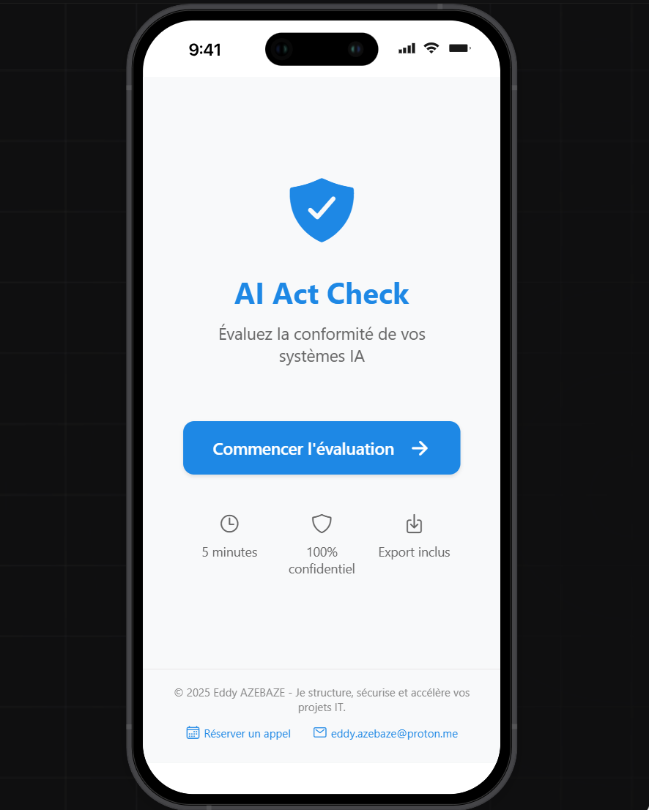
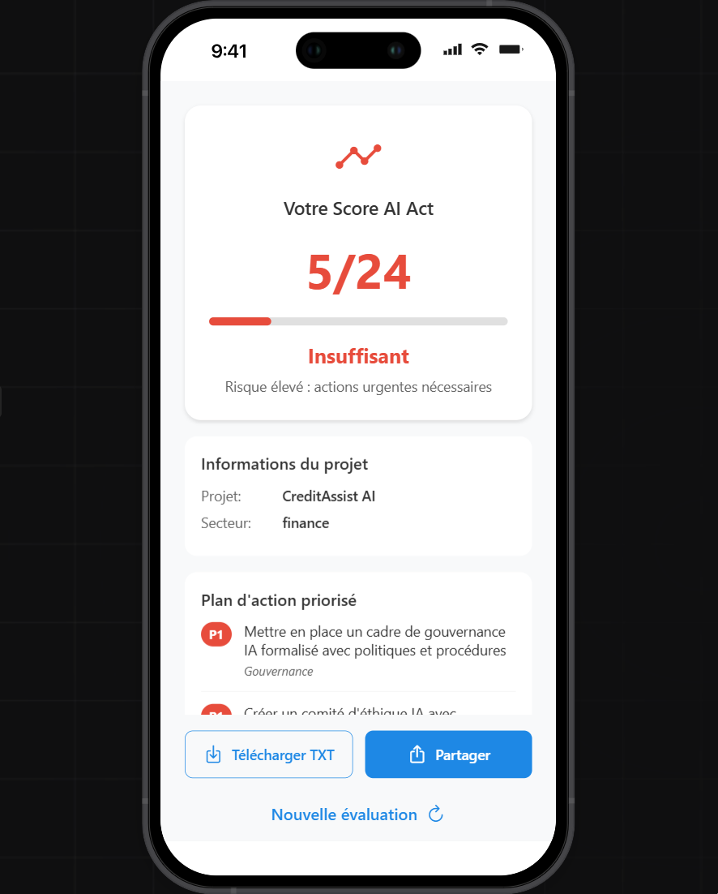
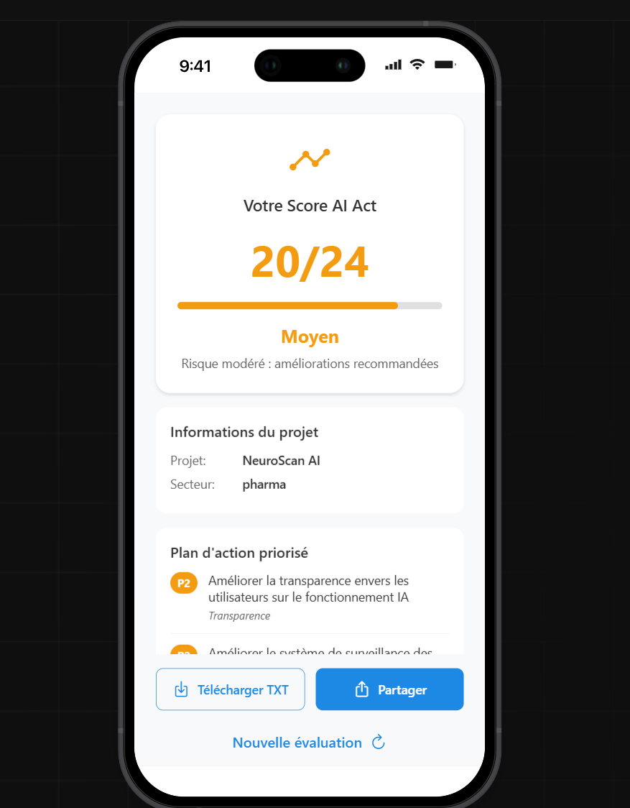

# 📱 Application Mobile - AI Act Readiness Scorecard

Version mobile développée sur [Emergent.sh](https://emergent.sh) pour **iOS**, dans le cadre du projet **AI Act Readiness Scorecard**.

> ✅ 100 % hors ligne • ✅ Aucune donnée collectée • ✅ Interface en français • ✅ Conforme RGPD

## 🎯 Objectif de l’application mobile

Permettre aux **décideurs IT (DSI, CTO, DPO)** d’effectuer une **auto-évaluation rapide de conformité IA** directement depuis leur smartphone, sans connexion internet, en moins de 5 minutes.

- Idéal pour les comités de pilotage, audits de terrain ou déplacements
- Fonctionne **sans cloud, sans compte, sans collecte de données**
- Export des résultats en TXT ou PDF

## 🧱 Stack technique

- **Framework** : React Native + Expo
- **Navigation** : Expo Router (file-based routing)
- **Design** : Thème clair uniquement, couleur primaire #1e88e5
- **Hors ligne** : 100 % autonome (no internet required)
- **Export** : `expo-file-system` + `expo-sharing`
- **Packages clés** :
  - `expo-router`
  - `@expo/vector-icons`
  - `expo-file-system`
  - `expo-sharing`

## 📂 Structure du dossier

mobile/
├── exports/
│   └── emergent-export.zip
├── screenshots/
│   ├── home-screen.png
│   ├── score-credit-assist-ai.png
│   ├── score-neuroscan-ai.png
│   └── score-hr-assistant-pro.png
└── README.md

## 📸 Captures d’écran incluses

| Fichier | Description |
|--------|-------------|
|  | Écran d’accueil : titre "AI Act Check", bouton "Commencer l’évaluation", branding Eddy AZEBAZE |
|  | Résultat du cas **Scoring crédit (banque)** : Score 5/24, niveau ❌ Insuffisant |
|  | Résultat du cas **Tri médical (santé)** : Score 20/24, niveau 🔶 Moyen |
|  | Résultat du cas **Chatbot RH (entreprise)** : Score 22/24, niveau ✅ Bon |

> 💡 Ces snapshots illustrent des **cas réels** avec des scores variés, pour montrer la maturité IT du système.

## 🛠️ Mode d’emploi

1. Téléchargez le fichier ZIP :  
   → `mobile/exports/emergent-export.zip`
2. Importez-le dans [Emergent.sh](https://emergent.sh) pour :
   - Dupliquer le projet
   - Personnaliser les couleurs, textes, questions
   - Générer une nouvelle version
3. Exportez l’app pour iOS (ou partagez le lien de démo)

> ✅ L’application fonctionne 100 % hors ligne. Aucune donnée n’est collectée.

## 🔗 Contact

Ce projet est conçu par **Eddy AZEBAZE** - Chef de projet IT stratégique, spécialisé en IA responsable, conformité (AI Act, GDPR), gouvernance IT et transformation SI.

📅 Tu veux adapter cet outil à ton SI ? Parlons-en :  
👉 [Réserver un appel (30 min)](https://calendly.com/eddyazebaze-proton/30min?month=2025-08)  
📧 eddy.azebaze@proton.me  
🔗 [LinkedIn](https://linkedin.com/in/eddyazebaze)
