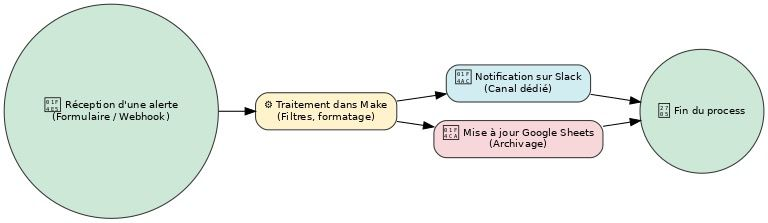
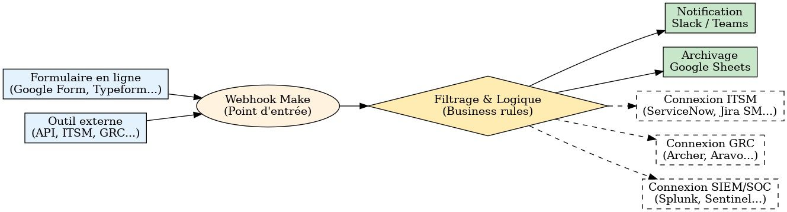
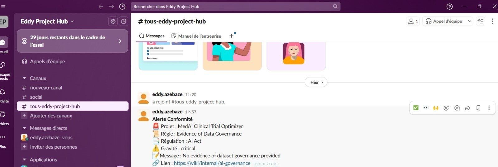

# 📢 Automated Compliance & Incident Alert Flow
**_(Make = orchestrateur ; Slack = alerte ; Google Sheets = journal)_**

## 📝 Objectif
Ce projet démontre comment automatiser la **collecte**, la **transformation** et la **diffusion** d’alertes de conformité ou de sécurité en utilisant **Make** (ex-Integromat) comme plateforme d’orchestration, reliée à des connecteurs clés tels que **Slack** et **Google Sheets**.

Cette première version V0 montre un flux simple et fonctionnel, avec des pistes d’évolution vers des intégrations plus avancées (ITSM, GRC, SIEM...).

> **Résumé exécutif (10s)**  
> La **V0** prouve un **flux temps réel simple et fiable** : une source envoie un événement → **Make** le reçoit → **Slack** notifie instantanément → **Google Sheets** historise pour audit.  
> Valeur immédiate : **partage rapide**, **traçabilité**, **déploiement no-code**.  
> Rôle chef de projet : **cadrage ROI**, **time-to-value court**, **scalabilité** (ITSM/GRC/SIEM).

---

## 1) Ce que **fait déjà** la V0 (et pourquoi ça compte)
- **Diffusion rapide** : l’info critique atteint l’équipe en **quelques secondes** (Slack).  
- **Traçabilité** : chaque événement est **journalisé automatiquement** (Sheets) pour KPI / post-mortem / audit.  
- **Simplicité & agilité** : **Make** orchestre sans code, duplicable en quelques minutes.

**Architecture V0 (schéma de flux)**  
> Make est le cœur du système ; les canaux sont **interchangeables** (Slack ↔ Teams, Sheets ↔ Jira/DB).



---

## 2) BPMN - vue “business-friendly”
> Lecture en 3 secondes : **Entrée** → **Make (règles)** → **Alerte** + **Archivage**.



---

3) Démo rapide (60 secondes)

1. Ouvrir **ReqBin** (ou Postman). Méthode **POST** → URL du **webhook Make**.  
2. Body (**JSON**) :

    ```json
    {
      "projectName": "MedAI Clinical Trial Optimizer",
      "complianceStatus": "Evidence of Data Governance",
      "regulation": "AI Act",
      "priority": "Critical",
      "message": "No evidence of dataset governance provided",
      "source": "https://wiki/internal/ai-governance"
    }
    ```

3. **Send** → vérifier :  
   - Slack : message reçu dans le canal d’alerte.  
   - Google Sheets : nouvelle ligne ajoutée (horodatée).

> 🎯 À montrer : capture Slack + capture de la ligne dans Sheets (preuve de fonctionnement).

---

**📸 Preuve de fonctionnement**  

*Capture Slack :*  
  

*Capture Google Sheets :*  


---

## 4) Spécification V0 (MVP)

**Entrée (JSON minimal accepté)**  

| Champ        | Description                                                                 | Exemple                                                    |
|--------------|------------------------------------------------------------------------------|------------------------------------------------------------|
| Timestamp    | Date et heure ISO 8601 de l’événement                                       | `2025-08-10T22:45:46.212Z`                                 |
| Project Name | Nom du projet ou système concerné                                           | `MedAI Clinical Trial Optimizer`                           |
| Rule Name    | Nom de la règle ou du contrôle ayant déclenché l’alerte                     | `Evidence of Data Governance`                              |
| Regulation   | Règlement ou norme concernée                                                | `AI Act`                                                   |
| Severity     | Niveau de criticité (*Low*, *Medium*, *High*, *Critical*)                   | `Critical`                                                 |
| Message      | Description courte ou résumé de l’alerte                                    | `No evidence of dataset governance provided`               |
| Link         | Lien vers plus de détails (wiki interne, rapport, ticket ITSM, documentation) | `https://wiki/internal/ai-governance`                      |

- **Google Sheets** : colonnes A–G (Timestamp, Project Name, Rule Name, Regulation, Severity, Message, Link).

**Sorties**

- **Slack** : message lisible (priorité + projet + message).  

*Alerte Conformité*

:rotating_light: *Projet :* {{1.project_name}}
:scroll: *Règle :* {{1.rule_name}}
:bookmark_tabs: *Régulation :* {{1.regulation}}
:warning: *Gravité :* {{1.severity}}
:page_facing_up: *Message :* {{1.message}}
:link: *Lien :* {{1.link}}

Petit rappel :

Les {{1.xxx}} font référence aux champs venant du webhook/Google Sheets dans ton scénario Make (V0).

Slack utilise *texte* pour le gras (pas **).

---

## 5) 🔍 Gestion intelligente des alertes (concept pour V0.1)

- **Par criticité** : n’alerter en Slack/Teams que `priority ∈ {"High","Critical"}`.  
- **Par catégorie** : router ITSM → #ops-major ; GRC → #risk-compliance ; SIEM → #soc-alerts.  
- **Par mots-clés** : ex. “PII”, “Prod down”, “ISO expiring”.

> Recommandation : **Slack = High/Critical**, **Sheets = 100%** des événements (audit & analytics).

---

## 6) Valeur business

Cette automatisation permet :

- **Réduction du temps de réaction** face à une alerte : information critique partagée **en temps réel** (Time-to-Notify ↓).  
- **Moins d’erreurs humaines** dans la transmission d’informations critiques : tout le monde voit la même info, au même endroit, **tout de suite**.  
-  **Meilleure traçabilité** grâce à l’archivage structuré. : audit trail prêt sans effort (Sheets) - **RGPD / AI Act / ISO**.  
-  **Scalabilité** pour traiter un volume important d’événements sans surcharge humaine : même moteur **Make**, canaux **remplaçables** sans casser le flux.

---

## 7) Adaptation aux plateformes stratégiques (vision)

1. **ITSM** (ServiceNow, Jira Service Management, Freshservice…)  
   - *Cas d’usage* : signalement d’incidents, ouverture de tickets, escalade.
2. **GRC** (Archer, Aravo, OneTrust…)  
   - *Cas d’usage* : non-conformités, suivi d’audits, alertes réglementaires (RGPD, AI Act).
3. **SIEM/SOC** (Splunk, Microsoft Sentinel, IBM QRadar…)  
   - *Cas d’usage* : alertes cybersécurité, déclenchement de playbooks, priorisation.

> Message clé : **l’outil n’est pas le canal** ; le cœur, c’est **Make** (orchestration & règles).

---

## 8) Sécurité & conformité (V0 → V0.1)

- **Protéger le webhook** : exiger un header `x-make-apikey: <secret>` (stocké côté Make).  
- **Ne pas publier** l’URL du webhook dans le README public.  
- **RGPD/AI Act** : éviter les **PII** dans Slack ; préférer un **lien** vers l’outil source.

---

## 9) KPIs à suivre **dès la V0**

- **⏱ Time-to-Notify** (webhook → Slack) : viser **≤ 5 s**.  
- **📚 Couverture d’archivage** (events journaux / events reçus) : **≥ 99%**.  
- **🔕 Bruit** (messages non actionnables / total) : mesurer avant filtres → baisse attendue en V0.1.

---

## 10) Roadmap (évolutions sans lourdeur)

### V0.1 (≈ 30–45 min, no-code)

- **Filtres Make** : `priority in ["High","Critical"]` (Sheets = 100%).  
- **Header secret** : `x-make-apikey` + variables sécurisées.  
- **Template message** : mise en forme Slack (emojis, gras, lien).  
- **Data dictionary** : geler les colonnes Sheets.

### V1 (½ journée)

- **Canal alternatif** : **Teams** en parallèle / remplacement.  
- **Routage par catégorie** : ITSM → #ops-major ; GRC → #risk-compliance ; SIEM → #soc-alerts.  
- **Payload standardisé** + validation (champs requis).

### V2 (1–2 jours, ROI fort)

- **Connexion ITSM** (ServiceNow/Jira SM,Freshservice) : signalement d’incidents, ouverture automatique de tickets, escalade.  
- **Connexion GRC** (Archer/Aravo/OneTrust) : notification de non-conformités, suivi d’audits, alertes réglementaires.  
- **Connexion SIEM** (Splunk, Microsoft Sentinel, IBM QRadar) : transmission d’alertes de cybersécurité, déclenchement de playbooks. 
- **KPIs Power BI** : Time-to-Notify, MTTR, bruit vs alertes utiles.
- **Transformation automatique** de formats (PDF/Excel → JSON).
-**Authentification sécurisée** sur le webhook.

---

## 11) Livrables V0

- **Schéma de flux** : `./screenshots/flux_make_slack_sheets_v0.png`  
- **BPMN “business-friendly”** : `./screenshots/bpmn_make_v0_business.png`  
- **BPMN détaillé (PDF)** : `./docs/BPMN_Workflow_Alerte.pdf`  
- **Captures** : Slack (message), Google Sheets (ligne ajoutée)

---

## 12) Scénario Make - actif & documenté (à intégrer V0.1)

- **Webhook** : URL Make (privée), JSON d’entrée minimal.  
- **Slack** : canal cible, message formaté, variables dynamiques.  
- **Google Sheets** : fichier/onglet, mapping colonnes.  
- **Filtres** : criticité / catégorie (si activés).  
- **Captures** : schéma Make + exécutions (logs).

---

## 13) Arborescence recommandée

```text
03-automated-compliance-incident-alert-flow/
├─ README.md
├─ /docs
│  └─ BPMN_Workflow_Alerte.pdf
├─ /screenshots
│  ├─ flux_make_slack_sheets_v0.png
│  └─ bpmn_make_v0_business.png
├─ /templates
│  ├─ alerts_sheet_template.csv
│  ├─ slack_message_template.txt
│  └─ teams_adaptive_card.json
└─ /scenarios
   └─ make-scenario.json   # (export Make ultérieurement)

---

## 👤 Auteur
**Eddy AZEBAZE**  
Chef de projet IT stratégique – Expert GRC • IA • Data & Insights • Cybersécurité

📅 **Un projet à fort enjeu, un cadrage à lancer ?** Prenons 30 min ensemble : [Réserver un appel](https://calendly.com/eddy-azebaze-proton/30min)  
[LinkedIn](https://www.linkedin.com/in/eddy-azebaze-034a20226/)

---

## 🏷️ Tags

`Make.com` `Automation` `Compliance` `Incident Management` `ITSM` `GRC` `SIEM` `Slack` `Google Sheets` `Workflow Automation` `Business Process` `Alerts` `Risk Management` `Regulatory Compliance` `AI Act` `Incident Response`
