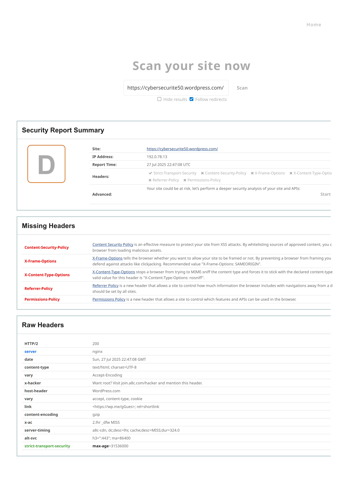

# 🔒 Audit Sécurité WordPress | OWASP • GRC • CISM


> Ce projet met en œuvre un audit de sécurité complet d’un site WordPress, en mobilisant les bonnes pratiques OWASP, des outils de scan reconnus, une approche GRC, et une restitution exploitable pour RSSI, PMO ou décideur IT.

---

## 📌 Contexte stratégique

**WordPress est le CMS le plus utilisé au monde**, donc également le plus ciblé par les attaques.

Ce projet vise à démontrer :

- **La capacité à configurer un site de test** WordPress.
- **La conduite d’un audit de sécurité** via des outils professionnels open-source.
- **La synthèse claire et actionnable** des résultats pour des décideurs ou équipes projets.

---

## 🎯 Objectif

Réaliser un **audit technique de sécurité** sur un site WordPress à l’aide d’outils open source, afin de :

- Identifier les failles critiques (OWASP, HTTP headers, etc.)
- Proposer des **recommandations concrètes et applicables**
- Produire un livrable documenté pour renforcer la gouvernance sécurité (CISM-ready)

---

## 🧱 Cadre d'analyse GRC

- **Normes & conformité** : RGPD, NIS2, ISO 27001
- **Stack analysée** : CMS WordPress en production
- **Approche orientée décideur** : priorisation des risques + remédiations exploitables

---

## 🛠️ Technologies & outils utilisés

| Outil                  | Utilisation principale                            | Lien |
|------------------------|---------------------------------------------------|------|
| `OWASP ZAP`            | Scan de vulnérabilités automatisé                 | [🔗](https://www.zaproxy.org/) |
| `Mozilla Observatory`  | Analyse des entêtes HTTP                         | [🔗](https://observatory.mozilla.org/) |
| `Security Headers`     | Vérification des headers de sécurité              | [🔗](https://securityheaders.com/) |
| `WordPress`            | Plateforme cible de l’audit                       | [🔗](https://wordpress.org/) |
| `Markdown`             | Documentation et reporting                       | —    |

---

## 📦 Livrables

| Type                      | Lien                                                                 |
|---------------------------|----------------------------------------------------------------------|
| 🔍 Résultats détaillés     | [`security-summary.md`](./exports/security-summary.md)               |
| 📋 Checklist sécurité     | [`checklist-securite.md`](./checklist-securite.md)                   |
| 🖼️ Captures visuelles     | [`/screenshots/`](./screenshots/)                                    |
| 🌐 Synthèse en ligne      | [cybersecurite50.wordpress.com](https://cybersecurite50.wordpress.com) |
| 📁 Données brutes         | [`exports/`](./exports/)                                             |

---

## 📌 Méthodologie

1. **Scan initial** du site WordPress via OWASP ZAP & SecurityHeaders
2. **Analyse manuelle** des résultats (headers HTTP, cookies, redirections)
3. **Production de livrables** synthétiques pour les décideurs
4. **Structuration GRC** avec recommandations remédiables
5. **Documentation & versioning GitHub**



---

## 📊 Résultats & Synthèse

- 🔒 Vulnérabilités critiques détectées : `3`
- 🛡️ Headers manquants : `Strict-Transport-Security`, `Content-Security-Policy`, etc.
- 🧠 Recommandations clés : passage en HTTPS forcé, durcissement des cookies, mise à jour des plugins
- ✅ Score Mozilla Observatory initial : `F` → objectif `B+` après remédiation

Consultez la **[synthèse de sécurité complète](./exports/security-summary.md)**.

---

## 🧠 Insights Clés

| Insight                            | Détail                                                                |
|------------------------------------|-----------------------------------------------------------------------|
| 🚨 Sécurité HTTP                   | Headers critiques absents ou mal configurés                          |
| 🔐 Cookies                         | Non marqués `HttpOnly`, `Secure` ou `SameSite`                       |
| 🧱 OWASP ZAP                       | Vulnérabilités exposant des infos sur le serveur                     |
| 🧭 GRC                             | Documentation formalisée pour RSSI / conformité                      |

---

## 🚀 Projection IA / automatisation

Prochaine étape : intégrer un pipeline CI/CD avec audit automatique des URLs WordPress via OWASP ZAP API + reporting auto (Markdown ou Notion).

---

## 🎯 Cas d’usage

- **RSSI / Décideurs sécurité** : rapport synthétique pour plan d’action
- **Chefs de projet** : intégration sécurité by design
- **Consultants conformité** : support d’évaluation RGPD / NIS2 / DORA

---

## 👥 Public cible

- RSSI / DSI / DPO/ Responsable conformité
- PMO / Chef de projet IT
- Écoles & étudiants en cybersécurité ou GRC

---

## 📂 Arborescence du projet

```
04-audit-securite-wordpress/
│
├── README.md
├── checklist-securite.md
├── demo.md
├── iframe.md
├── resources-outils-cyber.md
│
├── exports/
│   ├── security-summary.md
│   ├── Automated Scan_Zap.csv
│   └── ...
│
├── screenshots/
    ├── observatory-result.png
    └── ...
```

---

## 📬 Contact

👤 **Eddy AZEBAZE**  
📧 [eddy.azebaze@proton.me](mailto:eddy.azebaze@proton.me?subject=Audit%20WP&body=Bonjour%20Eddy%2C%20je%20souhaite%20en%20savoir%20plus%20sur%20votre%20audit%20WordPress...)  
📅 [Réserver un appel stratégique](https://calendly.com/eddy-azebaze-proton/30min)  
🔗 [LinkedIn](https://www.linkedin.com/in/eddy-azebaze-034a20226)

> **🧠 “On ne livre pas un projet. On construit un actif stratégique : durable, traçable, auditable.”**
