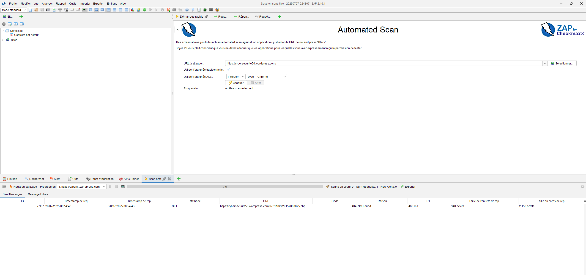
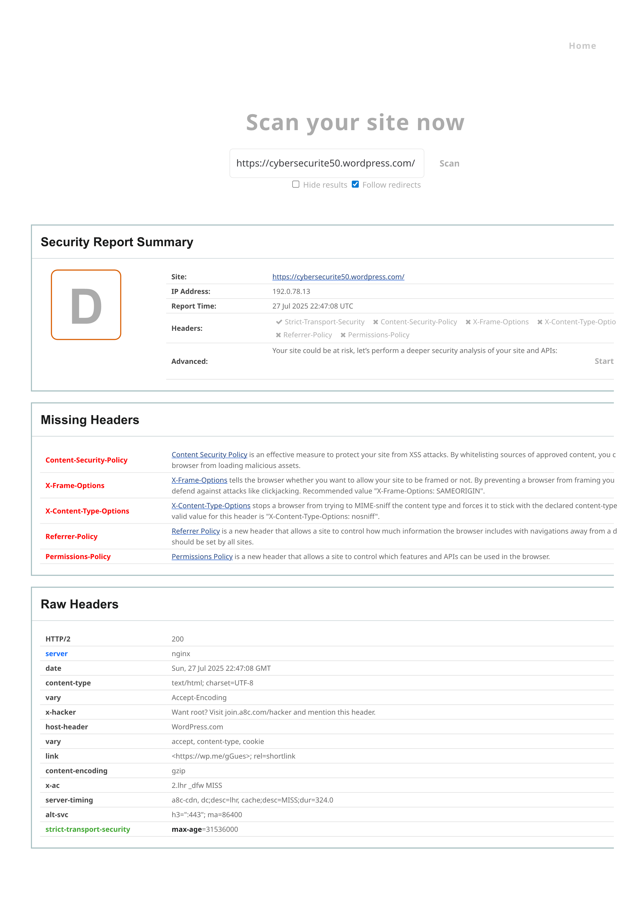
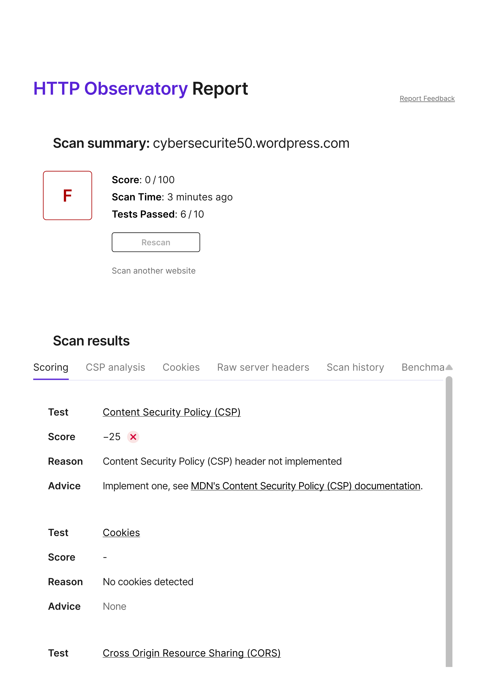

# 🧪 Démonstration visuelle | Audit Sécurité WordPress

Ce projet démontre un audit de sécurité **concret** réalisé sur un site WordPress déployé en environnement public.  
Voici les captures essentielles à inclure pour illustrer les différentes étapes du projet :

---

## 🔍 1. Déploiement du site WordPress

Aperçu du site configuré sur WordPress.com pour les besoins du test d’audit :

---

## 🛡️ 2. Scan OWASP ZAP

Scan automatisé effectué avec l’outil **OWASP ZAP**.  
Ci-dessous une capture du rapport généré localement :

---

## 🧩 3. Résultats Security Headers

Le site a été testé sur la plateforme [https://securityheaders.com](https://securityheaders.com)  
🔎 Niveau de score attribué : **F (headers manquants ou faibles)**

---

## 🛰️ 4. Résultats Mozilla Observatory

Le test [HTTP Observatory by Mozilla](https://observatory.mozilla.org) affiche également un score de **F**  
Cela confirme l'absence de protections HTTP essentielles :

---

## 🧠 5. Résultat attendu & interprétation

Ces résultats démontrent l'importance :
- d’activer les **headers de sécurité**
- de maintenir à jour la configuration serveur
- d’auditer régulièrement même un CMS comme WordPress

Une page dédiée dans le projet détaille les vulnérabilités détectées et propose des **actions correctives** concrètes (voir `pages/` dans le site déployé).
