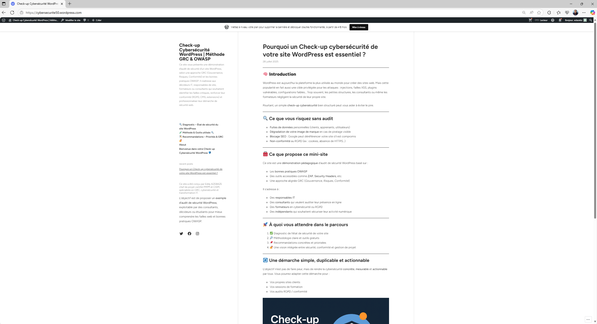

# 🔗 Démo publique du site WordPress audité

👉 Le site WordPress est accessible ici :  
🌐 [cybersecurite50.wordpress.com](https://cybersecurite50.wordpress.com)

> ⚠️ Ce site est un environnement de **démonstration**. Il ne contient aucun contenu sensible ni données utilisateurs.

---

📸 **Aperçu visuel :**

---

## 🎯 Objectif

Ce site a été créé spécifiquement pour :

- Déployer un environnement WordPress léger
- Simuler une surface d’attaque réaliste
- Lancer des audits via :
  - OWASP ZAP
  - [SecurityHeaders.com](https://securityheaders.com)
  - [Mozilla Observatory](https://observatory.mozilla.org)
- Documenter et démontrer une **démarche d’évaluation de sécurité** simple à répliquer

---

🔁 **Note :** Aucun backend, base de données ou extension personnalisée n’a été ajoutée.  
Le projet est orienté **pédagogie, prévention et mise en pratique rapide.**
