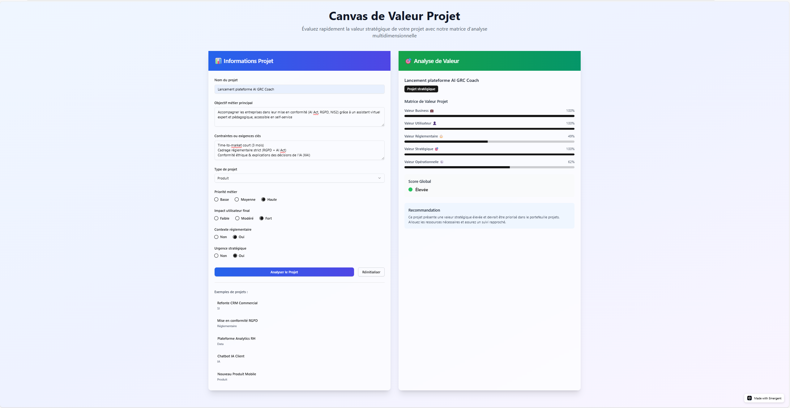

# 🎯 Project Value Canvas | Visualisation de la valeur projet


## 🎯 Objectif  
Proposer un **canvas visuel stratégique** pour aider les chefs de projet, PMO et décideurs à :
- Clarifier la **valeur attendue** d’un projet dès le cadrage
- Aligner les enjeux business, IT, GRC, IA, sécurité
- Faciliter les arbitrages rapides et documentés

## 🧭 Contexte stratégique  
Dans les projets IT à forts enjeux, la valeur réelle est souvent diluée :
- Multitude de parties prenantes
- Risques réglementaires (AI Act, RGPD, NIS2…)
- Tensions entre delivery et gouvernance

Ce **canvas** agit comme un **outil d’aide à la décision** pour reconnecter la gouvernance à l’impact terrain.

---

## 🛠️ Technologies / Outils  
- **Emergent.sh** (No-code app builder)
- Export `.zip` personnalisé (visuel + config)
- Déploiement sur **Vercel** pour démonstration
- Visualisation responsive intégrable dans Notion ou Miro (si besoin)

---

## 📦 Livrables  
- Canvas interactif déployé via Vercel (ou intégré)
- Fichier `.zip` exporté depuis Emergent
- Fiches README (racine + exports + méthodologie)
- Captures d’écran du canvas

---

## 🧪 Approche Chef de Projet  
| Étape           | Détail                                                                 |
|------------------|------------------------------------------------------------------------|
| 📌 Cadrage        | Identification des besoins projet, enjeux & risques                    |
| 🧠 Conception     | Modélisation du canvas sur Emergent.sh                                 |
| 🧪 Tests          | Validation de l’ergonomie, clarté du rendu                             |
| 📝 Documentation  | Rédaction de READMEs explicites et structurant                         |
| 🚀 Déploiement    | Mise en ligne via Vercel + documentation GitHub                        |
| 🎯 Résultats      | Un canvas clé-en-main pour cadrage, ateliers, reporting projet         |

---

## 💡 Insights clés  
- Visualiser la **valeur projet** en un clin d’œil
- Identifier les **points de friction** dès le lancement
- Créer un référentiel commun entre IT, GRC, IA, DSI, RSSI, COMEX

---

### 📸 Aperçu du Canvas  


> Exemple : **Lancement plateforme AI GRC Coach**  
> Ce visuel illustre l’analyse de valeur sur 5 axes (Business, Réglementaire, Utilisateur, Stratégique, Opérationnel).

---

## 🔮 Projection 2026 (Bonus)  
- ✨ Intégration d’une IA copilote pour ajuster le canvas selon le contexte
- 📈 Utilisation dans des modules de formation (PMP®, GRC, AI Readiness)
- 🔄 Version collaborative sur Miro / Notion
- 📊 Connexion à des dashboards (Power BI, Notion DB) pour pilotage continu

---

## 👥 Cas d’usage  
- PMO ou DSI souhaitant poser les bases d’un projet complexe  
- Cadrage de projets liés à l’IA, cybersécurité, conformité  
- Formations ou ateliers de gouvernance projet

---

## 🎯 Public cible  
- DSI, PMO, RSSI, chefs de projet, consultants  
- Toute organisation pilotant des projets IT critiques ou réglementés

---

## 🗂️ Arborescence du dossier
```
05-project-value-canvas/
├── README.md
├── screenshots/
│   ├── apercu-canvas.png
│   └── README.md
├── exports/
│   ├── emergent-export.zip
│   └── README.md
└── resources/
    ├── methodologie-canvas.md
    └── README.md
```

---

## 📢 Contact  
👤 [Eddy AZEBAZE](https://www.linkedin.com/in/eddy-azebaze-034a20226)  
📅 [Réserver un appel de cadrage](https://calendly.com/eddy-azebaze-proton/30min)

---

> _“Un bon cadrage vaut mille réorganisations.”_
